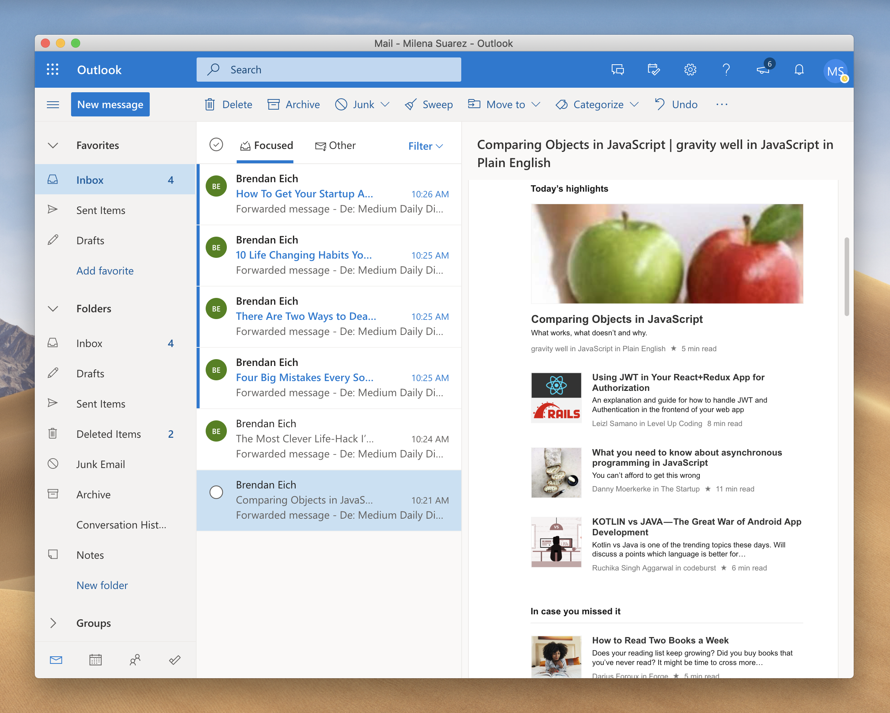

# Prospect Mail client


[](https://david-dm.org/julian-alarcon/prospect-mail) [](https://david-dm.org/julian-alarcon/prospect-mail?type=dev)

The Outlook desktop client for the [new Outlook Interface](https://www.microsoft.com/en-us/microsoft-365/blog/2018/06/13/power-and-simplicity-updates-to-the-office-365-user-experience/) from MS Office 365.



## Needed configuration in your Outlook Web configuration

> It's recommended to enable the new design to be able to use this client

## Feature

* Receive your Outlook OWA MS Office 365 online from the desktop app
* Close to minimise
* Dock tray support
* System notification

### Architecture components

The main software architecture components and their versions are this:

* [Node.js](https://nodejs.org/en/) version: 12.16.x
* [yarn](https://yarnpkg.com/) version: 1.22.x or newer
* [electron](http://electronjs.org/) version: 8.2.x
* [electron-builder](https://www.electron.build/) version: 22.5.x
* [electron-settings](https://github.com/nathanbuchar/electron-settings) version: 3.2.0

## Build

Clone the repository and run in development mode. (You need to have [git](https://git-scm.com/ , node and yarn) installed)

```bash
git clone https://github.com/julian-alarcon/prospect-mail.git
cd prospect-mail
yarn
yarn start
```

Build the application for linux

```bash
yarn run dist:linux
```

This will build an AppImage, deb and snap files in the dist folder. This files can be run in most popular linux distributions.

Is possible to specify the snap or AppImage build type using running this:

```bash
yarn run dist:linux:snap
```

Build the application for Mac (It works in versions 10.14 and 10.15)

```bash
yarn run dist:macOS
```

## Download

The released application can be downloaded [here](https://github.com/julian-alarcon/prospect-mail/releases).

## Installation

Snap build are available in the Snapcraft Store. You can search `prospect-mail` from the Software Store in Ubuntu and linux distributions or use `sudo snap install prospect-mail` from the terminal.

Once it was builded, or using the release files available, you can install the files using [AppImage process](https://docs.appimage.org/user-guide/faq.html#question-how-do-i-run-an-appimage), using .deb ```sudo dpkg -i prospect-mail_x.y.z_arch.deb``` or using the snap file ```sudo snap install prospect-mail_x.y.z_arch.snap --dangerous```.

## Release

```bash
npm version (new release version)
git push origin master
git push origin --tags
npm publish
```

## License

[MIT](https://github.com/julian-alarcon/prospect-mail/blob/master/LICENSE) by [Julian Alarcon](https://desentropia.com) based on work on [electron-outlook](https://github.com/eNkru/electron-outlook) by [Howard J](https://enkru.github.io/)
