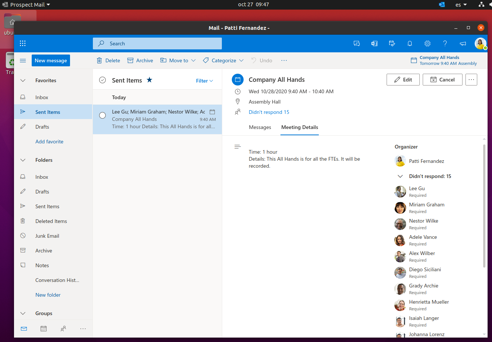
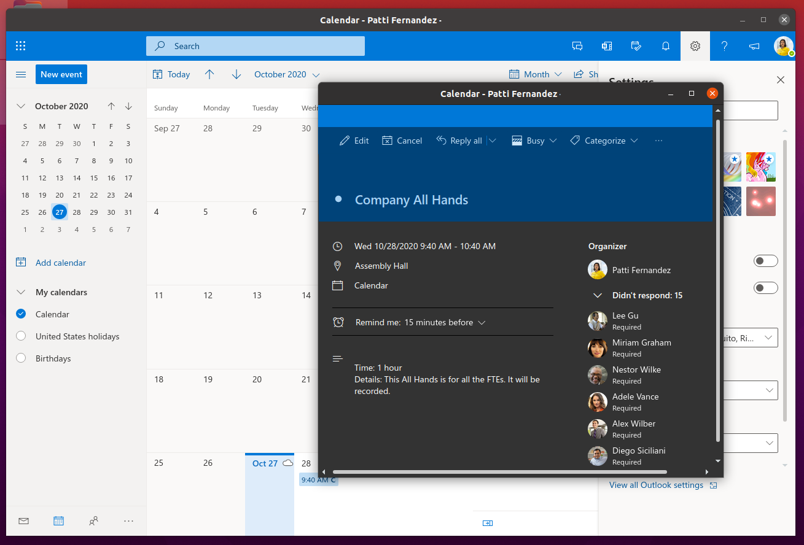

# Prospect Mail


[](https://github.com/julian-alarcon/prospect-mail/actions/workflows/build-release.yml)
[](https://github.com/julian-alarcon/prospect-mail/releases/latest)
[](https://github.com/julian-alarcon/prospect-mail/releases)

Unofficial email Outlook client using Electron. It uses the
[Web App](https://www.microsoft.com/en-us/microsoft-365/outlook/web-email-login-for-outlook)
and wraps it as a standalone application using Electron. This only works for
Microsoft/Office 365 accounts, don't use it for personal Outlook.com accounts.

Available for Linux, Windows (10+) and macOS.

> This project has NO DIRECT AFFILIATION with Microsoft, Microsoft 365 or any
> product made by Microsoft.

## Download

The application can be downloaded from [release page](https://github.com/julian-alarcon/prospect-mail/releases).

Select the appropriated file depending on your OS:

- Windows: `.exe` file or `.msi` file
- macOS: `.dmg` file
- Linux: Multiple artifacts are available, please choose your needed one
(`AppImage`, `deb`, `flatpak`, `pacman`, `rpm`, `snap`, `tar.gz`) depending on
your Linux Distribution.

## Installation

### Windows

Just double-click and follow the Installer steps.

### macOS

Double-click the `dmg` file and drag the blue Prospect Mail icon to the App
folder

### Linux

Snap builds are available in the Snap Store.

[](https://snapcraft.io/prospect-mail)

Or use `sudo snap install prospect-mail` from the terminal.

Arch Linux has a community published artifact available in
[AUR here](https://aur.archlinux.org/packages/prospect-mail-bin/).

For other distributions please follow your specific steps.

## Screenshots





## Features

- Check your Outlook Microsoft 365 emails/calendar from the desktop app
- Close to minimize
- Start minimized: toggle via tray icon Settings menu, or use command-line
flag `prospect-mail --minimized`
- Dock tray support
- System notification
- Connect to standard or custom Outlook URL
- Spellcheck using native Outlook MS Editor
- Visualize files (pdf) in emails

## Settings

Via tray menu `settings.json` can be opened and edited. After every save you
need to click in "Reload settings" to apply changes.

### Available Settings

```json
{
  "urlMainWindow": "https://outlook.office.com/mail",
  "urlsInternal": [
    "outlook.live.com/mail/deeplink",
    "outlook.office365.com/mail/deeplink",
    "outlook.office.com/mail/deeplink",
    "outlook.office.com/calendar/deeplink",
    "to-do.office.com/tasks"
  ],
  "urlsExternal": [
    "outlook.live.com",
    "outlook.office365.com",
    "outlook.office.com"
  ],
  "safelinksUrls": [
    "outlook.office.com/mail/safelink.html",
    "safelinks.protection.outlook.com"
  ],
  "showWindowFrame": true,
  "hideOnClose": true,
  "hideOnMinimize": true,
  "startMinimized": false,
  "customBrowserPath": "microsoft-edge"
}
```

#### Setting Descriptions

| Setting             | Description                                                                                  | Default                           |
| ------------------- | -------------------------------------------------------------------------------------------- | --------------------------------- |
| `urlMainWindow`     | Main Outlook service URL to load                                                             | `https://outlook.office.com/mail` |
| `urlsInternal`      | Array of URL patterns for deeplinks that open in new app windows                             | See example above                 |
| `urlsExternal`      | Array of URL patterns for Outlook/Microsoft 365 services that open in the main window       | See example above                 |
| `safelinksUrls`     | Array of URL patterns for Microsoft Safe Links that open in external browser                 | See example above                 |
| `showWindowFrame`   | Show/hide window frame and title bar                                                         | `true`                            |
| `hideOnClose`       | Minimize to tray instead of quitting when closing window                                     | `true`                            |
| `hideOnMinimize`    | Hide to tray when minimizing window                                                          | `true`                            |
| `startMinimized`    | Start app minimized to tray (also available via tray menu or `--minimized` flag)             | `false`                           |
| `customBrowserPath` | Custom browser for external links. Use command name (e.g., `"firefox"`) or full path        | System default                    |

### Example Configuration for Personal Outlook

This configuration will let you use Prospect with personal Outlook.com account:

> [!WARNING]
> Please notice that Prospect Mail is only tested in Work/Educational accounts
> and no issues will be reviewed on use for personal accounts.

```json
{
  "urlMainWindow": "https://login.live.com/login.srf",
  "urlsInternal": ["outlook.com", "live.com"],
  "urlsExternal": ["outlook.com", "live.com"]
}
```

### Architecture components

The main software architecture components and their versions are this:

- [Node.js](https://nodejs.org/en/about/previous-releases#release-schedule)
version: 22.x LTS
- [npm](https://docs.npmjs.com/) (comes with Node.js)
- [electron](https://www.electronjs.org/docs/latest/tutorial/electron-timelines)
version: 39.x
- [electron-builder](https://www.electron.build/) version: 26.x
- [electron-store](https://github.com/sindresorhus/electron-store)
  version: 8.2.0

## Build

Clone the repository and run in development mode.
(You need to have [git](https://git-scm.com/) and node installed)

```shell
git clone https://github.com/julian-alarcon/prospect-mail.git
cd prospect-mail
npm install
npm start
```

**Note:** If you encounter a sandbox error on Linux, run:
`ELECTRON_DISABLE_SANDBOX=1 npm start`. See
[CONTRIBUTING.md](CONTRIBUTING.md#troubleshooting-sandbox-issues) for details.

Build the application for Linux

```shell
npm run dist:linux
```

This will build an AppImage, deb, flatpak and snap files in the dist folder.
These files can be run in most popular Linux distributions.

You can specify a specific build type:

```shell
npm run dist:linux:snap
npm run dist:linux:flatpak
npm run dist:linux:appimage
```

Build the application for Mac (It works in versions 10.14 and 10.15)

```shell
npm run dist:mac
```

Build it for windows:

```shell
npm run dist:windows
```

### Install developer artifact

Once it has been built, or using the release files available, you can install
the files using:

- AppImage: Follow the [AppImage
  process](https://docs.appimage.org/user-guide/faq.html#question-how-do-i-run-an-appimage)
- Deb: `sudo dpkg -i prospect-mail_x.y.z_arch.deb`
- Snap: `sudo snap install dist/prospect-mail_x.y.z_arch.snap --dangerous`
- Flatpak: `flatpak install --user dist/prospect-mail_x.y.z_arch.flatpak`

## Contributing

Contributions are welcome! Please see [CONTRIBUTING.md](CONTRIBUTING.md) for
guidelines on how to contribute to this project, including development setup,
coding standards, and the release process.

## License

[MIT](https://github.com/julian-alarcon/prospect-mail/blob/master/LICENSE) by
[Julian Alarcon](https://desentropia.com) based on
[electron-outlook](https://github.com/eNkru/electron-outlook) by
[Howard J](https://enkru.github.io/)
